# Dotnet-Design-Patterns

This repository is a compact, practical collection of C# examples that demonstrate common software design patterns. Each folder contains a focused, runnable demo that illustrates the pattern's intent, structure, and minimal implementation.

Purpose
- Provide concise, well-organized examples for learning and quick reference.
- Keep demos small and readable so they can be executed and inspected easily.

Quick start
- Install .NET SDK 8.0 or later: https://dotnet.microsoft.com
- Run the root demo:

```bash
dotnet run --project DesignPatterns.csproj
```

Run an individual pattern from its folder:

```bash
dotnet run
```

Repository layout
- `DesignPatterns.csproj` — root runner and example entrypoint.
- One folder per pattern (e.g., `Behavioral.Observer`, `Creational.Builder`).
- `Images/` — diagrams referenced in the README.

Guidelines for contributors
- Keep examples focused and minimal.
- Add short console output examples to `Program.cs` files when appropriate.
- When changing target frameworks, ensure `Directory.Build.props` is updated and generated assembly attributes are handled to avoid duplicate-attribute errors.

- Patterns
- Below each pattern entry you will find a short description, the most important characteristics, and an illustrative image (linked to the repository's Images folder).

## Creational Patterns

### 1) Abstract Factory
- Intent: Provide interfaces for creating families of related objects without specifying concrete classes.
- Key points: promotes consistency across related products; isolates concrete implementations; good for plugin-like families (PDF/XLS/Plain reports).
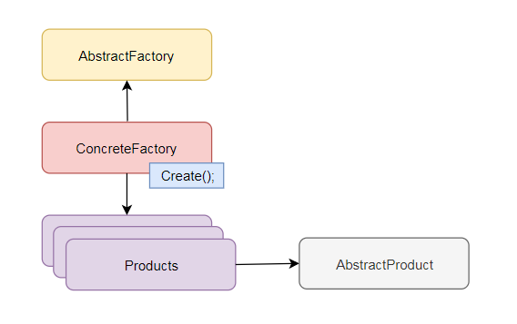

### 2) Builder
- Intent: Separate object construction from representation to allow different constructions using the same process.
- Key points: useful for stepwise construction, complex initialization, and fluent APIs.
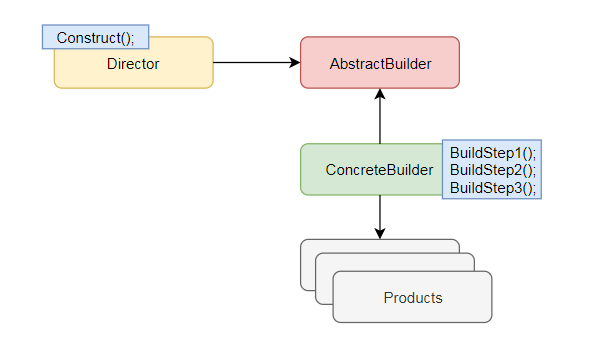

### 3) Factory Method
- Intent: Define an interface for creating an object but let subclasses determine which concrete class to instantiate.
- Key points: supports extensibility, hides instantiation logic, useful for view/page factories or product creation.
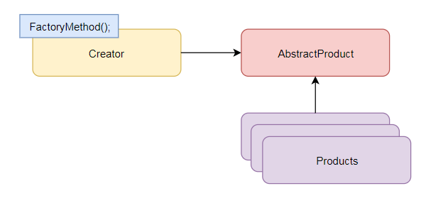

### 4) Prototype
- Intent: Create new objects by copying a prototypical instance.
- Key points: implement `Clone()` to produce initialized copies; useful when object creation is expensive or configuration - heavy.
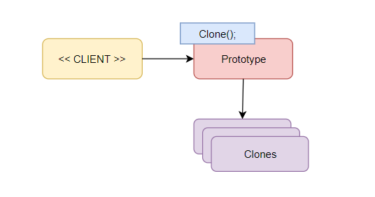

### 5) Singleton
- Intent: Ensure a class has only one instance and provide a global access point.
- Key points: use for shared services/config; prefer dependency injection over globals when possible.
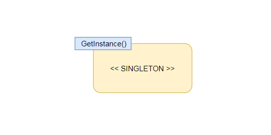

## Structural Patterns

### 6) Adapter
- Intent: Convert one interface to another expected by clients.
- Key points: useful for integrating incompatible APIs without changing existing code.
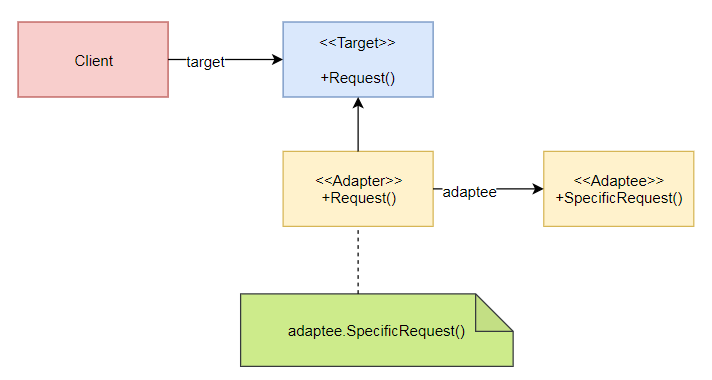

### 7) Bridge
- Intent: Decouple an abstraction from its implementation so the two can vary independently.
- Key points: separates interface and implementation, supports independent evolution.
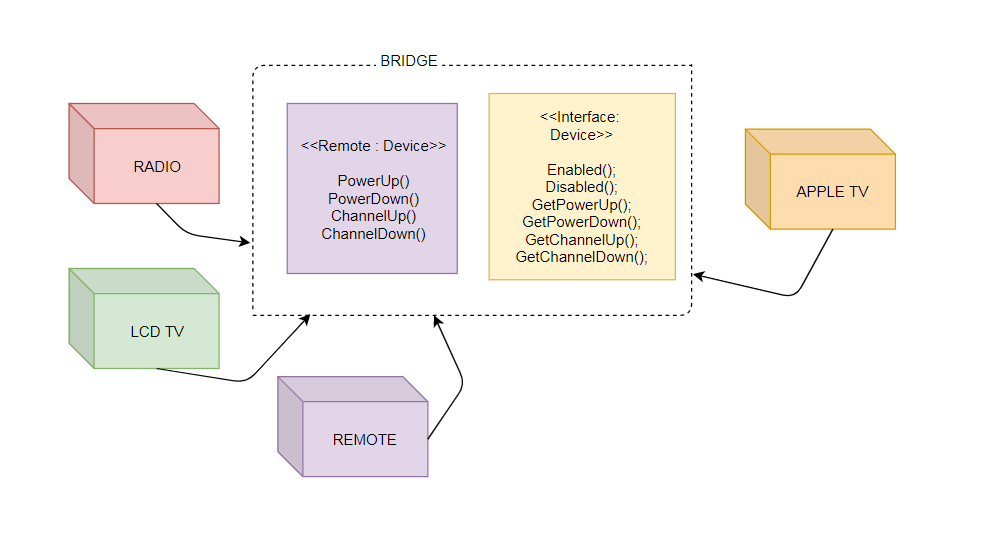

### 8) Composite
- Intent: Compose objects into tree structures and treat individual objects and compositions uniformly.
- Key points: models part–whole hierarchies; simplifies clients that use tree structures.
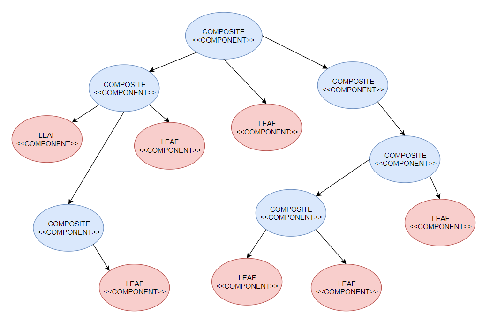

### 9) Decorator
- Intent: Attach additional responsibilities to an object dynamically.
- Key points: favors composition over inheritance; enables flexible behavior combinations.
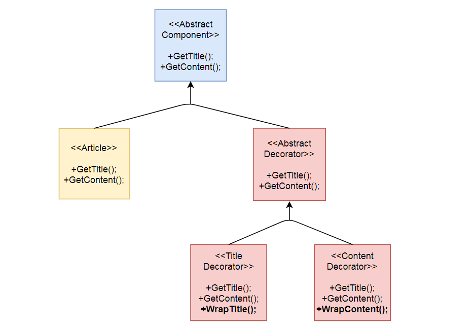

### 10) Facade
- Intent: Provide a simplified interface to a set of subsystems.
- Key points: reduces subsystem coupling and simplifies common workflows.
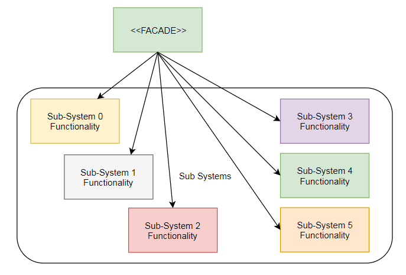

### 11) Flyweight
- Intent: Share fine-grained objects to minimize memory usage.
- Key points: separate intrinsic (shared) and extrinsic (context-specific) state; use for large numbers of similar objects.
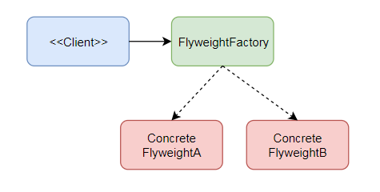

### 12) Proxy
- Intent: Provide a placeholder to control access to another object.
- Key points: remote, virtual, and protection proxies solve different access-control and performance scenarios.
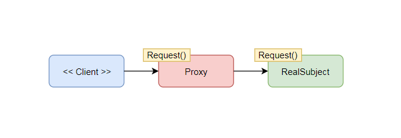

## Behavioral Patterns

### 13) Chain of Responsibility
- Intent: Pass requests along a chain of handlers until one handles the request.
- Key points: decouples sender and receiver; useful for approval/workflow chains.
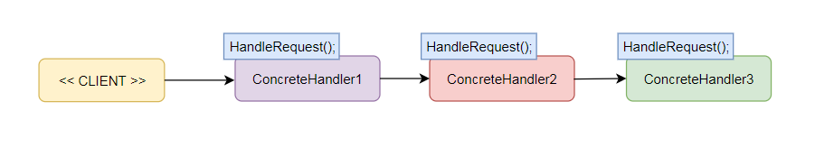

### 14) Command
- Intent: Encapsulate a request as an object to parameterize and store operations.
- Key points: supports undo/redo, queuing, and logging of operations.
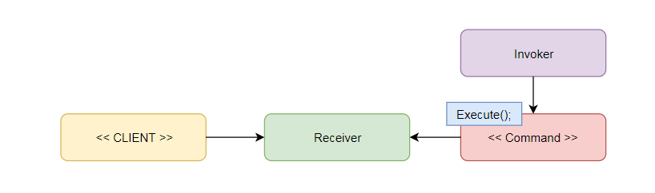

### 15) Interpreter
- Intent: Define a grammar and implement an interpreter to process sentences in that language.
- Key points: useful for DSLs, expression evaluators, and simple language processing.
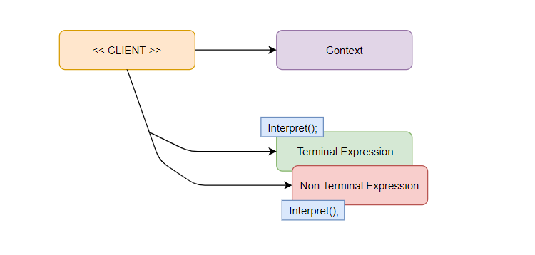

### 16) Iterator
- Intent: Provide sequential access to elements of an aggregate without exposing its representation.
- Key points: decouples traversal from aggregate structure.
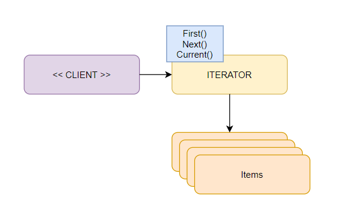

### 17) Mediator
- Intent: Encapsulate object interactions to promote loose coupling.
- Key points: centralizes communication to reduce direct dependencies between objects.
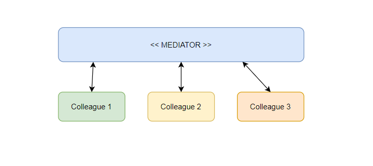

### 18) Memento
- Intent: Capture and restore an object's internal state without violating encapsulation.
- Key points: useful for checkpoints and undo functionality.
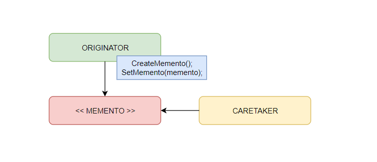

### 19) Observer
- Intent: Define a one-to-many dependency so dependents are notified automatically when state changes.
- Key points: decouples subject and observers; common in event-driven designs.
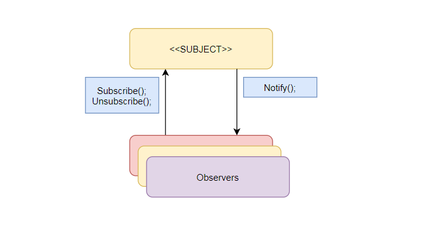

### 20) State
- Intent: Allow an object to change its behavior when its internal state changes.
- Key points: encapsulates state-specific behavior into separate classes.
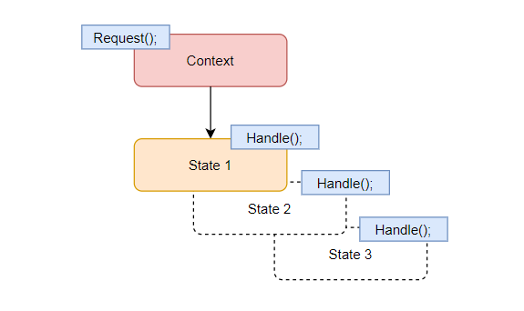

### 21) Strategy
- Intent: Define a family of interchangeable algorithms.
- Key points: encapsulates algorithms and selects them at runtime.
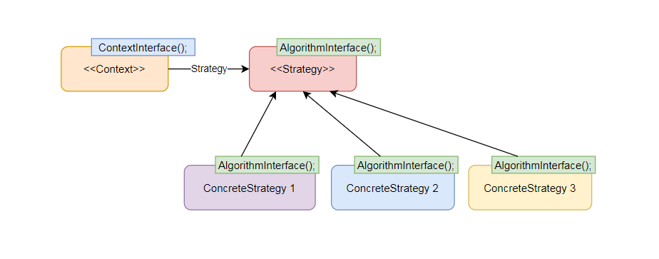

### 22) Template Method
- Intent: Define the skeleton of an algorithm and defer specific steps to subclasses.
- Key points: promotes code reuse and controlled extension points.
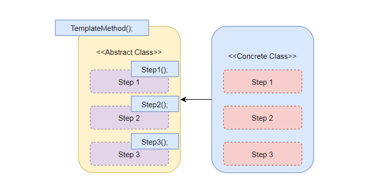

### 23) Visitor
- Intent: Define a new operation on elements of an object structure without changing their classes.
- Key points: useful for operations that must be performed across diverse object structures.
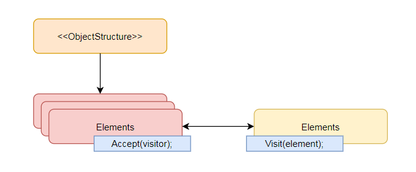

Architecture notes
- Common architectural patterns: MVC, MVP, MVVM — choose based on UI and platform constraints.
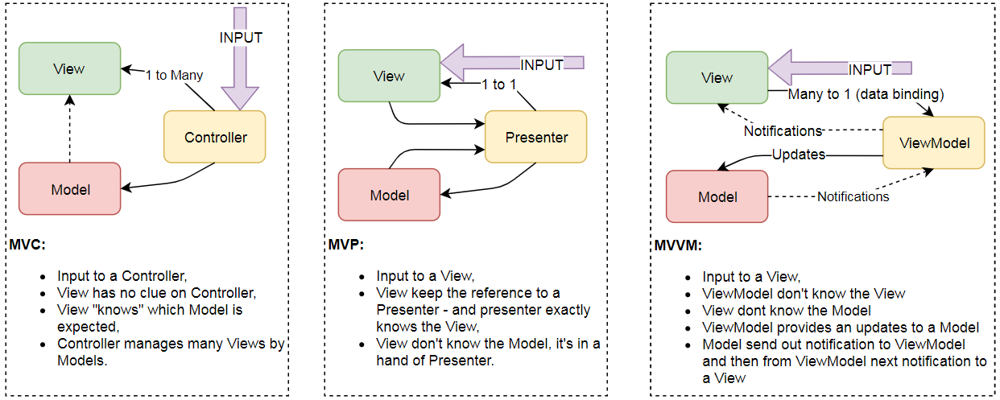

Troubleshooting
- If you see duplicate assembly attribute errors after changing project targets, remove `bin/` and `obj/` folders and rebuild.

```bash
find . -type d \( -name bin -o -name obj \) -prune -exec rm -rf {} +
dotnet clean
dotnet build
```

Contributing
- Open an issue or submit a PR. Suggested improvements: add console examples in `Program.cs`, unify project targets, or add anchors to this README.
		